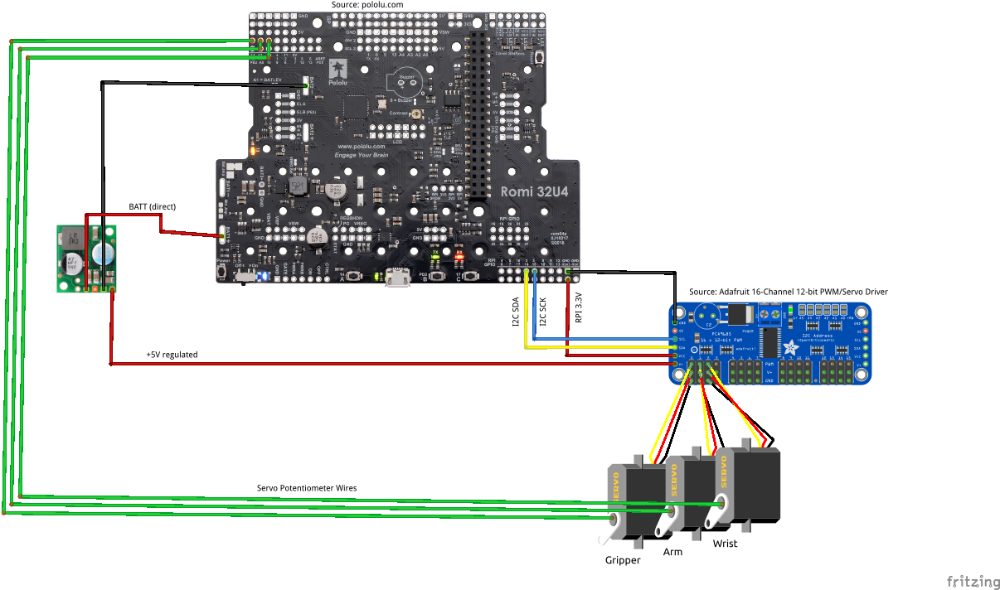

# Fork specific information
Pololu offers an accessory arm kit for their Romi Robot. As it is acknowledged in the description it is for advanced users and there are some HW limitation to make it work nicely. There are 2 main issues:
* The servos require a dedicated voltage regulator directly connected to the battery compartment. This has been previously described here: https://www.chiefdelphi.com/t/romi-arm/390825.
* Using the onboard additional PWM channels demonstrates some twitching of the servos which has been widely reported. The cause for this is (probably) that the auxiliary PWM channels on the Romi board are software based PWMs (unlike the motor servos which are connected to HW PWM ports) and the pulse width control via the interrupts is not accurate / constant enough. One possible solution to this is to add an add-on HW PWM controller (for example PCA 9685 as an additional I2C device which can be directly controlled from the Raspberry Pi in addition to the romi board and the LSM gyro chip) to connect the 3 arm servos. There is no more jitter/twitching with this solution.

The update to the library consists of a module for initializing and driving the PCA9685 chip at the default address 0x40 on the I2C bus, as well as a custom device (using the existing hooks for this) to create a romi-arm. This device's PWM channels are then exposed as additional servo ids in the romi simulation/robot code. For example, if none of the 5 extension onboard channels are configured as PWM, then romi onboard channels 0,1 are the motors, and the romi-arm channels have the ids 2,3,4.

## Wiring diagram

# wpilib-ws-robot-romi

Pololu Romi 32U4 Reference Robot for WPILib WebSocket Interface

## **Introduction**
This repository contains a reference implementation of a robot that can be controlled via the WPILib HALSim WebSocket extensions. The chassis and controller are based around the [Romi robot](https://www.pololu.com/category/202/romi-chassis-and-accessories) and associated [Control Board](https://www.pololu.com/product/3544) from Pololu.

## **Usage with WPILib**
For usage with WPILib, please take a look at the [WPILib Romi documentation](https://docs.wpilib.org/en/stable/docs/romi-robot/index.html). It has more information on how to install the WPILibPi Raspberry Pi image, which comes packaged with the software needed to image your Romi robot, and provides useful status information.

## **Kit of Parts**
NEW: Please see the [WPILib Romi documentation](https://docs.wpilib.org/en/stable/docs/romi-robot/index.html) for up-to-date information on the Romi hardware.

## **Software Dependencies**
NEW: Please use the 2021 WPILib installer ([Beta 4](https://github.com/wpilibsuite/allwpilib/releases/tag/v2021.1.1-beta-4) or later) to install the necessary development software for use with the Romi.

## **Raspbery Pi Installation**
NEW: For the latest information on how to image your Raspberry Pi for use with the Romi, please see the [WPILib Romi documentation](https://docs.wpilib.org/en/stable/docs/romi-robot/index.html).

## **Controlling The Robot via WPILib**
NEW: For the latest information on how to use WPILib with the Romi, please see the [WPILib Romi documentation](https://docs.wpilib.org/en/stable/docs/romi-robot/index.html).

### **Running Robot Project**
NEW: For the latest information on how to use WPILib with the Romi, please see the [WPILib Romi documentation](https://docs.wpilib.org/en/stable/docs/romi-robot/index.html).

In your robot project, Hit `F5` or run `Simulate Robot Code on Desktop` from the VSCode Palette (`Ctrl+Shift+P`).

Once your code compiles, a new selection dialog will appear. This lists all the extensions you had listed under `dependencies` in your `build.gradle` file. Select the `halsim_ds_socket.[so/dylib/dll]` and `halsim_ws_client.[so/dylib/dll]` options (file extension depends on your OS).

Upon clicking `OK`, your robot project should start running on the desktop, and you should something similar to the image below in your console:

If you see the line `WebSocket Connected`, you have established a connection to your robot! From this point, your WPILib-based robot code will trigger corresponding behaviors on the Romi (e.g. if you output `HIGH` on `DigitalOutput` channel 3, the yellow LED on the Romi will turn on). For more information about the pin mappings and assignments, see the [firmware README](firmware/README.md).

## **Theory of Operation**
This section provides more technical details on how this package works.

### **Communication Between Raspberry Pi and Romi 32U4 Board**
The Raspberry Pi and Romi 32U4 boards are connected via the 40-pin connector, and communicate over I2C. The Romi firmware uses the [Pololu Raspberry Pi interface library for Arduino](https://github.com/pololu/pololu-rpi-slave-arduino-library) to facilitate board-to-board communication.

Both boards essentially utilize a "shared memory buffer" to read/write to. The layout of this buffer can be found in the `sharedmem.json` file. Since both the firmware and JS code need to have the same buffer layout, the `generate-buffer.js` script reads in the `sharedmem.json` file and automatically generates a `shmem_buffer.h` file for the firmware and a `romi-shmem-buffer.ts` file for the Node application, thus keeping both sets of files in sync.

### **Application Structure**
The main entry point for the application is `src/index.ts`. The file is fairly small and serves as a binding layer for the `WPILibWSRomiRobot` class (which is defined in `src/romi-robot.ts`) and the `WPILibWSRobotEndpoint` class (which is defined in the [wpilib-ws-robot](https://github.com/wpilibsuite/wpilib-ws-robot) NPM package).

The `wpilib-ws-robot` package provides a wrapper around the guts of the WPILib WebSocket protocol, and allows developers to easily interface with other kinds of robots, simply by extending from the `WPILibWSRobotBase` class (also exposed by `wpilib-ws-robot`).

In the `src/romi-robot.ts` file, you can see how the defined class interacts with the Romi firmware over I2C.

The `src/i2c` folder contains both an I2C abstraction layer, and concrete implementations of a Raspberry Pi compatible I2C bus (`src/i2c/hw-i2c.ts`) and a mock I2C bus (`src/i2c/mock-i2c.ts`) that can be used for testing on non-Raspberry Pi platforms.

### **`wpilib-ws-robot` and `node-wpilib-ws` Packages**
This application depends on the `wpilib-ws-robot` package (as mentioned above), which in turn depends on `node-wpilib-ws`. The `node-wpilib-ws` package contains the core classes that implement the WPILib WebSocket protocol, and the code can be found at its [repository](https://github.com/wpilibsuite/node-wpilib-ws).

See the READMEs in each of the dependent packages to find out more about how to use them outside of this application.
